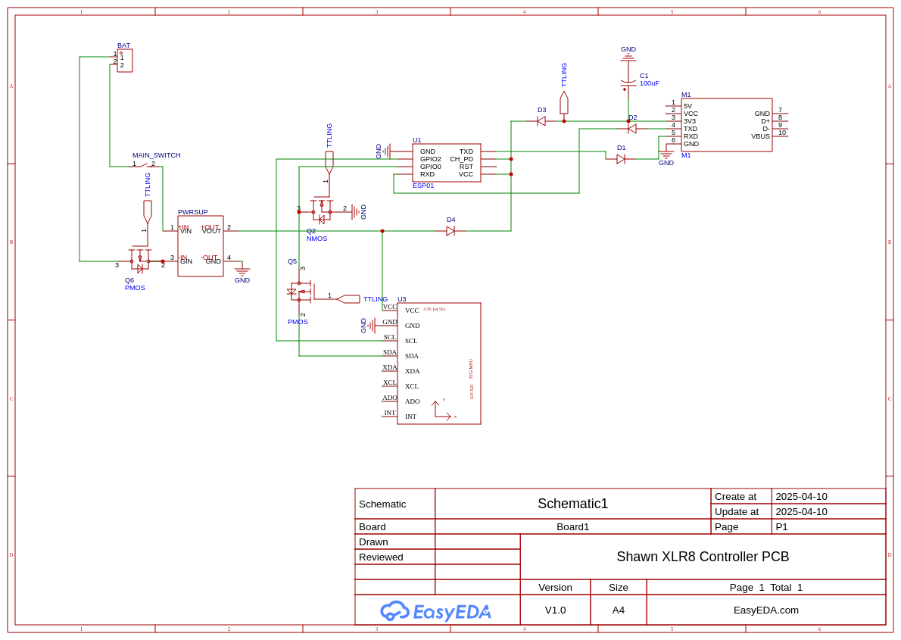

# Details n all

Circuit for USB to TTL: https://youtu.be/GQIzDSK4tMw?feature=shared
Circuit for normal usage: https://erc-xlr8.notion.site/Circuit-diagrams-3958e7bef94d49928b14370110e86e14

Both circuits individually are easy to make, I dont think I need to explain that

Combining the two and being able to switch between them is the tricky part

# Schematic

* If you ignore all transistors and diodes, you get the superposition of both circuits
* However, when the USB to TTL is connected, you want the rest of the circuit to switch off
* This is done by checking the voltage of the VCC of the USB to TTL converter to detect when its recieving power
* This is the flag TTLING, which is 3.3V when you are TTLing and 0V when you aren't
* The power of the battery should not affect this which is why there is a diode (D3)
* Same thing opposite direction which is why there is D4
* When TTLING is on, the battery power should be disconnected, which is why there is a PMOS (Q6)
* When TTLING is on, the GPIO0 pin is required to switch from SDA to GND
* This is done by a PMOS (Q5) and an NMOS (Q2)
* The diodes in Q6 and Q2 are unnessary
* But in Q5 I feel it should be there since if somehow SDA gives some voltage, it shouldn't short to GND
