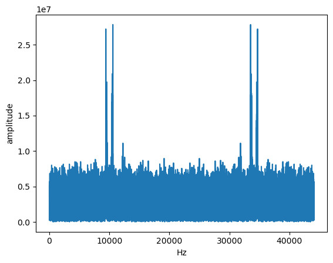
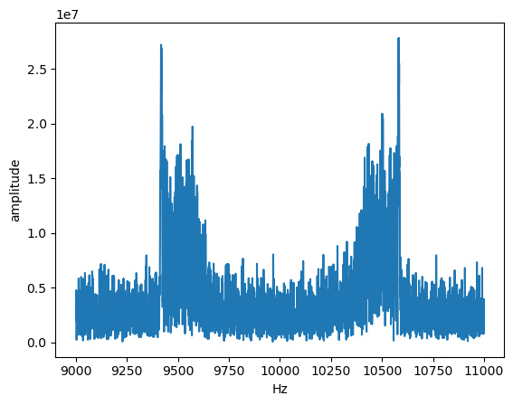
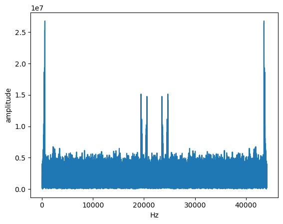
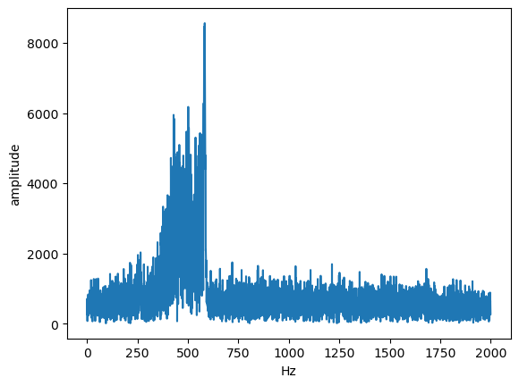
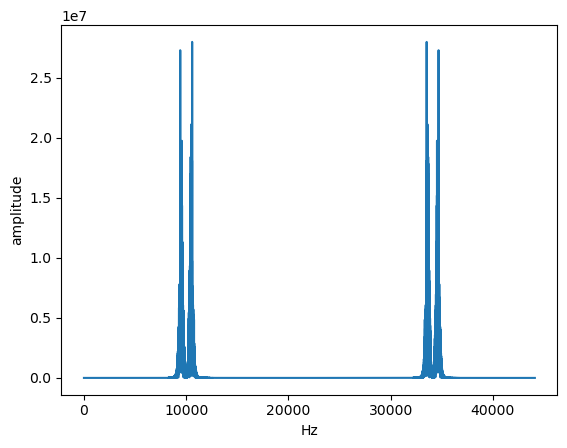
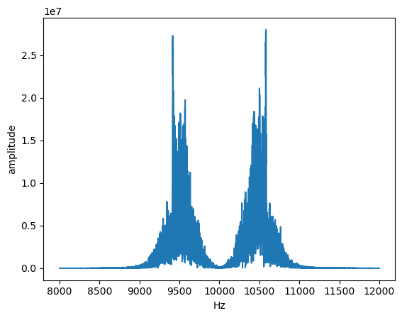
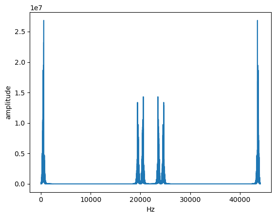
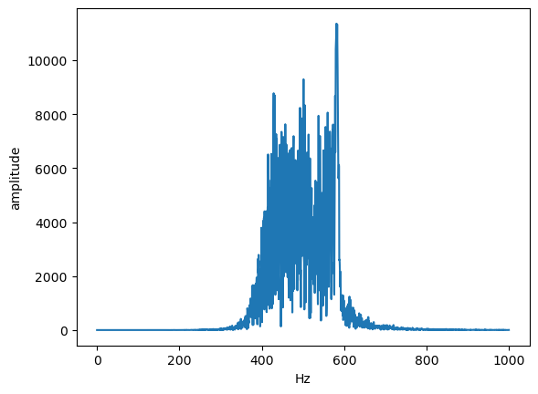

# Finding Carrier Frequency

Do FFT, there are two spikes at 9.5 KHz and 10.5 KHz

This implies carrier frequemcy is 10KHz

# Demodulation

* Multiply by sin(2 * pi * Fc * t) or cos(2 * pi * Fc * t)
* A peak will form at 0 Hz and 20KHz
* The 0 Hz peak was higher using sin, so I used sin

# Low pass

* Apply low pass filter to get actual signal

# Noise removal

Repat the last two steps except for two changes:
## Keep only the two peaks of 9.5 KHz and 10.5 KHz by adding two small bandpassed signals
FFT

After multiplying with sin

## Apply band pass filter to remove noise at the end
After low pass

After another band pass

This is the final signal